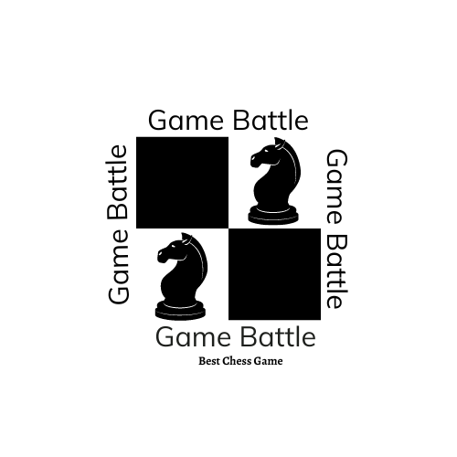

# Game Battle

## Introduction
Welcome to Game Battle, an engaging and visually appealing chess game for Android. This project was created to test and enhance my skills in Java, Android development, and game design.

**Deployed Site:** [Game Battle Landing Page](https://mutheejj.github.io/atomic-landing-page/)  
**Final Project Blog Article:** [My Journey Building Game Battle](https://www.linkedin.com/posts/johnmutheemaina_my-journey-building-game-battle-android-activity-7216131131048398849-CwCk?utm_source=share&utm_medium=member_desktop)  
**Author's LinkedIn:** [John Muthee](https://www.linkedin.com/in/johnmutheemaina/)

## Installation
To install and run the Game Battle app on your local machine, follow these steps:

1. **Clone the repository:**
   ```
   git clone https://github.com/mutheejj/GameBattle
   cd GameBattle
Open the project in Android Studio:

2. **Launch Android Studio:**
   
   Click on "Open an existing Android Studio project."
   Navigate to the cloned repository and select it.
   Build the project:

   Allow Android Studio to download necessary dependencies.
   Click on "Build" > "Make Project" to compile the app.
   Run the project:

3. **Connect an Android device or start an emulator.**
   Click on "Run" > "Run 'app'" to install and launch the app on the device/emulator.
   Usage
   Once installed, open the Game Battle app on your Android device. You can start a new game by selecting "New Game" from the main menu. The game features:

   Dynamic board updates as moves are made.
   A game history log to review and analyze previous moves.
   Responsive design that adapts to different screen sizes.
   Contributing
   Contributions are welcome! If you'd like to contribute to Game Battle, please follow these steps:

4. **Fork the repository:**
   Click the "Fork" button at the top right of the repository page on GitHub.

   Clone your fork:
      ```
      git clone https://github.com/your-username/GameBattle.git
      cd Gamebattle
   Create a branch:
      ```
      git checkout -b feature/your-feature-name
   Make your changes and commit them:

      ```
      git add .
      git commit -m "Add feature: your feature description"
   Push to your fork:
      ```
      git push origin feature/your-feature-name
      Create a pull request:
   Go to the original repository on GitHub and click "New pull request."
### Related Apps
Check out these related apps:

- [Champion Chess](https://play.google.com/store/apps/details?id=com.chess.champ&hl=en_US)

## Licensing
This project is licensed under the MIT License. See the [LICENSE](https://opensource.org/licenses/MIT) file for details.


# Inspiration and Goals

Game Battle was inspired by my lifelong passion for chess and strategic games. I've always enjoyed the intellectual challenge and depth that chess offers, and this project was an opportunity to combine my love for the game with my skills in software development. The goal was to create an engaging and interactive platform where players can enjoy chess battles, improve their strategic thinking, and challenge themselves against other players. The inspiration came from the desire to make a classic game accessible and exciting in a modern digital format. I set out to tackle the technical challenge of implementing the core chess mechanics and ensuring that the game adheres to the rules of chess. This involved developing robust algorithms for move validation, handling edge cases like castling and en passant, and enforcing checkmate and draw conditions. Additionally, I wanted to create a visually appealing and responsive user interface that would provide a seamless gaming experience on Android devices.
## Technical Details
Game Battle is built using Java for the core game logic, leveraging its robust object-oriented capabilities. The front-end interface is developed for Android using Android Studio, employing ConstraintLayout for responsive and flexible design. The project follows an MVC (Model-View-Controller) architecture to separate concerns and enhance maintainability. The Model handles the game logic and state, the View is responsible for the user interface, and the Controller manages the communication between the Model and View. One of the core algorithms in "Game Battle" is the move validation algorithm for the chess pieces. This algorithm ensures that each move made by a player adheres to the rules of chess. Code Snippet: Move Validation for a Knight

   ```
   public boolean isValidKnightMove(int startX, int startY, int endX, int endY) {
      int dx = Math.abs(startX - endX);
      int dy = Math.abs(startY - endY);
      return (dx == 2 && dy == 1) || (dx == 1 && dy == 2);
      }

This method checks if the move from (startX, startY) to (endX, endY) is valid for a knight, which moves in an L-shape.
Challenges and Learnings
Throughout the development process, I faced several technical and non-technical challenges. Implementing the move validation logic and ensuring that all chess rules were correctly enforced required a deep understanding of chess mechanics and extensive coding to handle all possible moves and scenarios. Maintaining smooth performance during gameplay, especially with complex animations and move calculations, was another challenge that I overcame by optimizing the game loop and utilizing multi-threading. As the sole developer, I also encountered challenges in project management, maintaining motivation and focus, and learning new technologies. I developed a disciplined schedule, used project management tools, and set clear, achievable milestones to ensure steady progress and timely completion. Engaging with online communities and mentors for feedback and encouragement, as well as scheduling regular breaks, helped me maintain motivation and avoid burnout. Working on "Game Battle" has deepened my interest in game development and algorithm design. I have gained valuable experience in applying object-oriented principles to solve complex problems and designing intuitive user interfaces. This project has also sparked an interest in exploring AI development for future enhancements, such as implementing a chess engine to provide challenging computer opponents.

## Next Steps
For future iterations of "Game Battle," I envision several key improvements and additions:

    - Implementing a chess engine: Developing an AI-powered chess engine to provide challenging computer opponents and enable single-player mode.
    - Adding online multiplayer: Integrating online features to allow players to challenge each other in real-time over the internet.
    - Enhancing the user interface: Refining the UI with more intuitive controls, animations, and visual effects to create an even more immersive gaming experience.
    - Implementing game modes: Introducing different game modes, such as timed games, tournaments, and puzzles, to add variety and cater to different player preferences.
    - Providing player statistics and rankings: Tracking player statistics, such as win-loss records and rating, and displaying player rankings to foster a sense of progression and competition.

By continuously enhancing the game's features and functionality, I aim to create a comprehensive and engaging chess platform that will appeal to a wide range of players, from casual enthusiasts to seasoned strategists.